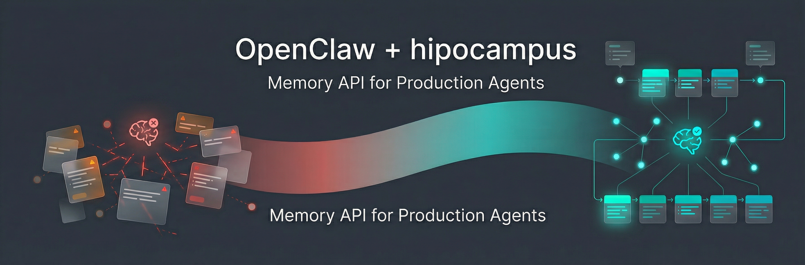
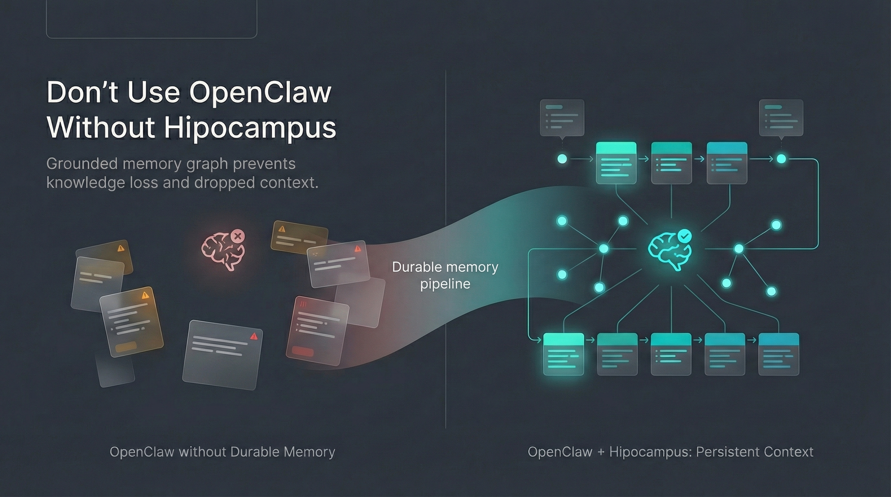
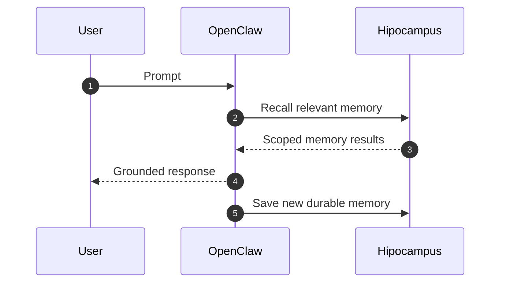
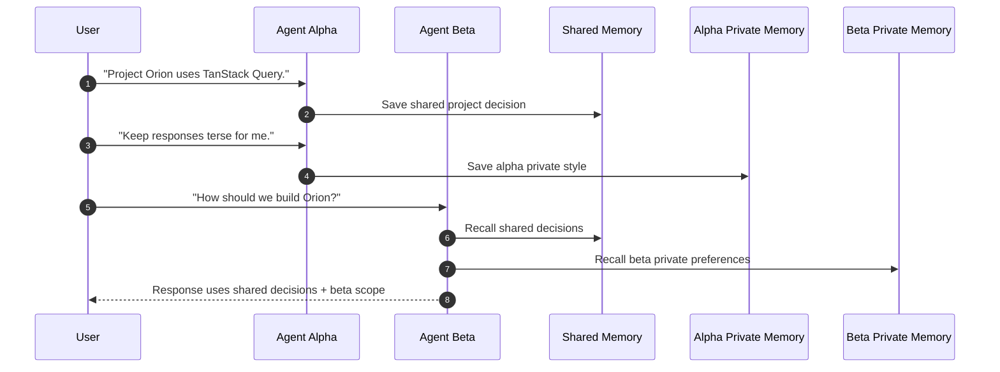

<div align="center">    </div>

<p align="center">
  <strong>Production-ready long-term memory for OpenClaw agents.</strong>
</p>

<p align="center">
  <a href="https://github.com/hipocampus-ai/openclaw-hipocampus#-configuration">Docs</a> ·
  <a href="https://github.com/hipocampus-ai/openclaw-hipocampus/issues/new?labels=bug">Report a bug</a> ·
  <a href="https://github.com/hipocampus-ai/openclaw-hipocampus/issues/new?labels=enhancement">Feature request</a> ·
  <a href="https://github.com/hipocampus-ai/openclaw-hipocampus/releases">Changelog</a>
</p>

<p align="center">
  <a href="https://github.com/hipocampus-ai/openclaw-hipocampus/blob/main/LICENSE"></a>
  <a href="https://github.com/hipocampus-ai/openclaw-hipocampus/issues"></a>
  <a href="https://github.com/hipocampus-ai/openclaw-hipocampus/commits/main"></a>
  <a href="https://github.com/hipocampus-ai/openclaw-hipocampus"></a>
</p>

OpenClaw Hipocampus is a memory layer for agent workflows. It helps agents preserve user preferences, project decisions, and continuity across sessions while keeping memory scoped for multi-agent collaboration.



## ✨ What You Get

- 🧠 **Long-term memory** across sessions, not just one chat window.
- 🤝 **Shared project memory** so multiple agents stay aligned.
- 🔒 **Private agent memory** for role-specific preferences and behavior.
- ⚡ **Fast memory usage** with recall + response + capture in one turn loop.
- 🛠 **Operational tools** for storing, searching, forgetting, and profiling memory.

## ⚙️ How It Works

1. A user prompt enters OpenClaw.
2. OpenClaw pulls relevant memory context from Hipocampus.
3. The agent answers using current prompt + recalled context.
4. New durable facts are captured for future turns.




## 🧪 Input → Output Examples

### 1) Preference Continuity

```text
Prompt:
"Keep your responses concise and prioritize local-first workflows."

What OpenClaw gets from memory:
- User prefers concise responses.
- User prefers local-first workflow.

Assistant output:
"Understood. I’ll keep responses concise and prioritize local-first workflows."
```

### 2) Shared Project Decision Across Agents

```text
Prompt (Agent A):
"For Project Orion, use TanStack Query and avoid Redux."

Later prompt (Agent B, same project):
"What state/data layer should we use for Orion?"

What OpenClaw gets from shared memory:
- Project Orion uses TanStack Query.
- Avoid Redux for Orion.

Assistant output:
"Use TanStack Query for Orion and avoid Redux."
```

### 3) Private Agent Behavior Isolation

```text
Prompt (Agent Alpha):
"When you respond for me, keep it terse and bullet-pointed."

Later prompt (Agent Beta):
"How should you format responses for me?"

What OpenClaw gets:
- Beta private preferences (if any)
- Shared project memory
- Not Alpha private style preferences

Assistant output:
"I’ll follow your preferences and project context for this workspace."
```

## 🛠 Tool I/O Sample

### `hippocampus_store`

```json
{
  "tool": "hippocampus_store",
  "params": {
    "text": "User prefers concise responses.",
    "category": "preference",
    "scope": "private"
  }
}
```

```json
{
  "content": [
    {
      "type": "text",
      "text": "Stored memory: \"User prefers concise responses.\""
    }
  ],
  "details": {
    "category": "preference",
    "targets": ["private"]
  }
}
```

### `hippocampus_search`

```json
{
  "tool": "hippocampus_search",
  "params": {
    "query": "What are the Orion architecture decisions?",
    "scope": "shared",
    "limit": 3
  }
}
```

```json
{
  "content": [
    {
      "type": "text",
      "text": "Found 2 memories:\n\n1. Project Orion uses TanStack Query. (97%)\n2. Avoid Redux for Orion. (94%)"
    }
  ],
  "details": {
    "count": 2,
    "memories": [
      {
        "id": "mem_a",
        "content": "Project Orion uses TanStack Query.",
        "similarity": 0.97,
        "bankId": "bank_shared"
      },
      {
        "id": "mem_b",
        "content": "Avoid Redux for Orion.",
        "similarity": 0.94,
        "bankId": "bank_shared"
      }
    ]
  }
}
```

## 🧭 Sample Flow (Shared + Private Memory)



## 🚀 Why It Is Production-Ready

- ✅ Graceful fallback if memory services are temporarily unavailable.
- ✅ Scoped memory model to reduce cross-agent leakage.
- ✅ Deterministic write behavior to reduce duplicate memory entries.
- ✅ Recall, store, forget, and profile tools for operational control.


## 🔧 Configuration

Set `HIPPOCAMPUS_OPENCLAW_API_KEY` or plugin `apiKey`.

```json
{
  "plugins": {
    "entries": {
      "openclaw-hipocampus": {
        "enabled": true,
        "config": {
          "apiKey": "${HIPPOCAMPUS_OPENCLAW_API_KEY}",
          "baseUrl": "http://localhost:8080",
          "autoRecall": true,
          "autoCapture": true,
          "sharedBankNameTemplate": "OpenClaw {project_label} Shared Memory",
          "agentBankNameTemplate": "OpenClaw {project_label} {agent_label} Private Memory",
          "maxRecallResults": 10,
          "readjustEnabled": true
        }
      }
    }
  }
}
```

## 🧪 Development

```bash
pnpm install
pnpm test
pnpm build
```

## ✅ Smoke Validation

1. Start Hipocampus local server (`:8080`).
2. Install plugin into OpenClaw.
3. Restart OpenClaw.
4. Run preference and project-memory scenarios.
