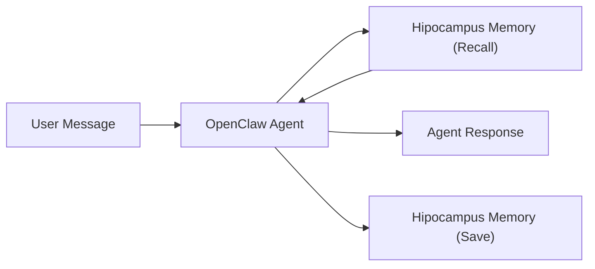

  

<h1>OpenClaw Hipocampus Plugin</h1>

Production-ready long-term memory for OpenClaw agents.

<h2>What You Get</h2>
<ul>
  <li>Agents remember user preferences across sessions.</li>
  <li>Project decisions stay consistent across multiple agents.</li>
  <li>Memory is scoped to support collaboration and privacy.</li>
  <li>Teams get continuity without changing their OpenClaw workflow.</li>
</ul>

<h2>How It Works (Simple)</h2>
<ol>
  <li>User sends a message to an OpenClaw agent.</li>
  <li>OpenClaw retrieves relevant memory context.</li>
  <li>The agent responds using current input + recalled context.</li>
  <li>Useful new information is saved for future turns.</li>
</ol>

<h2>Designs</h2>

Customer-facing visuals for architecture and memory experience.

<table>
  <tr>
    <td align="center" width="33%">
      
       
      Architecture Overview
    </td>
    <td align="center" width="33%">
      
       
      Recall Experience
    </td>
    <td align="center" width="33%">
      
       
      Structured Memory Events
    </td>
  </tr>
</table>

<h2>How It Scales (Advanced)</h2>
<ul>
  <li>Shared project memory aligns all agents on architecture and decisions.</li>
  <li>Private agent memory preserves role-specific preferences and operating style.</li>
  <li>Memory carries across sessions for long-running workstreams.</li>
  <li>Stored knowledge can be updated as new information supersedes old information.</li>
</ul>

<h2>Why It Is Production-Ready</h2>
<ul>
  <li>Graceful fallback behavior if memory is temporarily unavailable.</li>
  <li>Scoped memory model to reduce cross-agent leakage.</li>
  <li>Deterministic write behavior to reduce duplicate memory entries.</li>
  <li>Operational tools for store, search, forget, and profile workflows.</li>
</ul>

<h2>Configuration (Operator)</h2>

Set <code>HIPPOCAMPUS_OPENCLAW_API_KEY</code> or plugin <code>apiKey</code>.

<pre><code>{
  "plugins": {
    "entries": {
      "openclaw-hipocampus": {
        "enabled": true,
        "config": {
          "apiKey": "${HIPPOCAMPUS_OPENCLAW_API_KEY}",
          "baseUrl": "http://localhost:8080",
          "autoRecall": true,
          "autoCapture": true,
          "sharedBankNameTemplate": "OpenClaw {project_label} Shared Memory",
          "agentBankNameTemplate": "OpenClaw {project_label} {agent_label} Private Memory",
          "maxRecallResults": 10,
          "readjustEnabled": true
        }
      }
    }
  }
}</code></pre>

<h2>Development</h2>
<pre><code>pnpm install
pnpm test
pnpm build</code></pre>

<h2>Smoke Validation</h2>
<ol>
  <li>Start Hippocampus local server (<code>:8080</code>).</li>
  <li>Install plugin into OpenClaw.</li>
  <li>Restart OpenClaw.</li>
  <li>Run preference/project memory scenarios.</li>
</ol>
